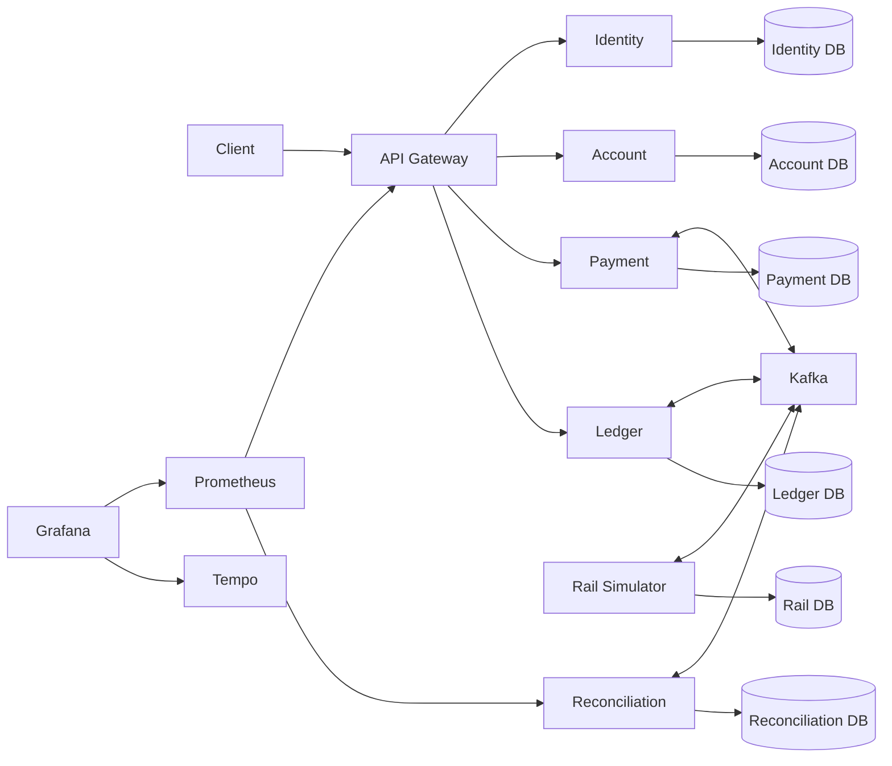
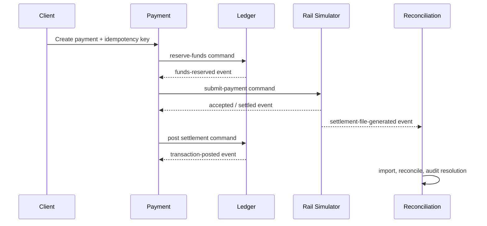

# CoreBank

> An educational core-banking sandbox built to make the difficult systems work visible: monetary correctness, asynchronous payment orchestration, duplicate delivery, failure compensation, and an audit-friendly operational boundary.

> **Sandbox, not a bank.** CoreBank must never receive real customer data, credentials, bank accounts, or payment-network traffic. It is not production certified or production ready.

## Why this project exists

Most payment demos stop once they can move a number from one row to another. CoreBank treats that as the beginning of the problem.

This repository models the constraints behind a payment platform: money has one authority; a payment workflow must survive retries and duplicate events; services cannot share a database or a distributed transaction; accepted is not settled; and an operational reconciliation decision must never silently alter money.

The result is a deliberately scoped NestJS monorepo that is small enough to inspect end-to-end, but contains the engineering decisions worth discussing in a backend interview.

## What it demonstrates

- **Separate NestJS services** for identity, accounts, ledger, payments, rail simulation, reconciliation, notifications, and the API gateway.
- **One PostgreSQL database per service**; no shared TypeORM entities or cross-service reads.
- An **immutable, double-entry ledger** using `BIGINT` minor units and decimal-string API values.
- **Reservation-backed payment sagas** over Kafka—without distributed database transactions.
- **Transactional outbox and consumer inbox** records to target one business effect with at-least-once delivery.
- **Idempotency keys plus request hashes** that reject accidental key reuse with a different command.
- **Deterministic rail scenarios** for success, retryable failure, rejection, timeout-after-acceptance, duplicate events, and out-of-order events.
- **Reconciliation** that finds and auditably resolves discrepancies without touching ledger state.
- **Correlation IDs**, structured redacted logs, health/readiness endpoints, Prometheus, Grafana, Tempo, and CI security scanning.

## Architecture at a glance



External clients speak REST only to the Gateway. Services communicate through versioned Kafka envelopes and exclusively own their own PostgreSQL databases.

| Area           | Implementation                                                                                        |
| -------------- | ----------------------------------------------------------------------------------------------------- |
| Runtime        | TypeScript, NestJS, Node.js 20+, pnpm workspaces                                                      |
| Data           | PostgreSQL 16, one database per service                                                               |
| Messaging      | Kafka with versioned `MessageEnvelope` contracts                                                      |
| Monetary model | `BIGINT` storage, `bigint` in the domain, decimal strings at the API boundary                         |
| Reliability    | Local transactions, transactional outbox, consumer inbox, idempotency keys and request hashes         |
| Observability  | Pino, OpenTelemetry, Prometheus, Grafana, Tempo, correlation IDs                                      |
| Quality gates  | Prettier, ESLint, TypeScript, Jest, Testcontainers, Docker Compose, GitHub Actions, pnpm audit, Trivy |

## The decisions that matter

### Ledger is the sole monetary authority

Payments own workflow state; accounts own customer metadata; neither is allowed to mutate monetary state. Only Ledger creates journal entries, owns reservations and balances, and permits corrections through new postings.

Each post locks its referenced ledger accounts in a local `QueryRunner` transaction, validates active accounts and currency alignment, and independently balances debit and credit totals per currency. A ledger posting is therefore atomic within Ledger, immutable once posted, and reproducible from entries.

### Money is never a JavaScript number

Amounts arrive as integer decimal strings such as `"10000"`, become `bigint` inside the domain, and are stored in PostgreSQL `BIGINT` columns. JSON responses convert them back to strings. This prevents silent floating-point rounding from becoming a monetary bug.

### Exactly-once delivery is not promised; one business effect is designed for

Kafka is treated as at-least-once. A producer writes its aggregate change and an outbox message in the same database transaction. A separate publisher delivers that record and marks it published. Consumers insert the envelope `messageId` into a local inbox before applying work, and do both in one transaction.

Commands that move money also carry deterministic idempotency keys. Reusing a key with a different request hash returns a conflict rather than creating another financial effect. This is a more honest and practical guarantee than claiming exactly-once messaging.

### Payments are a saga, not a cross-service transaction

Payment starts by persisting `RESERVING_FUNDS` and an outbox command. Ledger alone decides whether available funds can be reserved. For an internal transfer, successful reservation leads to a ledger posting; only Ledger's confirmation settles the payment. For a rail transfer, reservation leads to rail submission, and only a settlement event causes Ledger to post.

No Payment-to-Ledger database access, synchronous money mutation, or distributed transaction exists in the design.



### A reservation protects spendable funds without pretending settlement occurred

A reservation affects available balance, not posted balance. That distinction is what prevents a successful authorization from being mistaken for a completed transfer. Rejection, cancellation, and timeout paths release the reservation; refunds and reversals request new balanced ledger postings rather than rewriting history.

### Reconciliation is operational evidence, not a back door into the ledger

Settlement files are checksum-idempotent. A run produces discrepancies for missing or mismatched values. Resolving one writes actor, correlation, action, and details to an immutable audit record—but never changes Payment, Rail, or Ledger data. Financial correction remains an explicit ledger adjustment workflow.

## Failure cases deliberately exercised

These are the cases this project was designed around, rather than happy-path add-ons:

| Problem                                          | Design response                                                                                                                                                                                               | Tradeoff                                                                                                    |
| ------------------------------------------------ | ------------------------------------------------------------------------------------------------------------------------------------------------------------------------------------------------------------- | ----------------------------------------------------------------------------------------------------------- |
| Concurrent spending can oversubscribe an account | Ledger locks referenced accounts and computes reservations inside one local transaction; an integration scenario verifies only five 2,000-minor-unit reservations can succeed against 10,000 available units. | Locking trades throughput for correctness; scaling and query tuning are deliberately deferred.              |
| A message is delivered twice                     | Inbox records deduplicate `messageId`; idempotency keys protect commands.                                                                                                                                     | Effects are targeted once; Kafka delivery remains at least once.                                            |
| A producer crashes after state change            | Aggregate update and outbox record commit together; the publisher retries later.                                                                                                                              | The current publisher has bounded retries and local dead-letter records, not a managed production workflow. |
| Rail says accepted, then fails or times out      | Acceptance never changes ledger balance; failed terminal outcomes request reservation release.                                                                                                                | The rail is deterministic simulation, not an integration with a real scheme.                                |
| Events arrive out of order                       | Payment transitions are guarded by its current state and inbox deduplication; a simulator scenario intentionally emits settlement before acceptance.                                                          | There is no global ordering across aggregates.                                                              |
| A correction is needed after posting             | Refunds and reversals create new balanced transactions.                                                                                                                                                       | Historical records remain permanent; there is no in-place repair.                                           |
| An operator sees a settlement mismatch           | Reconciliation records a discrepancy and an immutable resolution audit trail.                                                                                                                                 | Resolution records an operational decision; it cannot fix money.                                            |

## Repository layout

```text
apps/
  api-gateway/              REST edge, OpenAPI, security headers, local rate limit
  identity-service/         Registration, login, JWT and refresh-token rotation
  account-service/          Customer and account metadata
  ledger-service/           Double-entry journal, balances, reservations, adjustments
  payment-service/          Payment aggregate and asynchronous saga orchestration
  rail-simulator/           Deterministic external-settlement scenarios
  reconciliation-service/   Settlement-file import, discrepancy tracking, audit resolution
  notification-service/     Service shell / extension boundary
libs/
  event-contracts/          Versioned envelopes and messaging contracts
  money/                    Minor-unit money value object
  correlation/              Request and message correlation context
  config/, logging/, errors/, testing/
 infra/                      Prometheus, Grafana and OpenTelemetry/Tempo local configuration
test/                       Integration scenarios
```

## Run it locally

### Prerequisites

- Node.js 20+
- pnpm 10 (the repo pins `pnpm@10.20.0`)
- Docker Desktop / Docker Compose

### Start the complete sandbox

```powershell
pnpm install
docker compose up --build
```

Or use the concise local demonstration script, which starts the stack and checks the Gateway, Prometheus, and Grafana health endpoints:

```powershell
.\scripts\demo.ps1
```

Useful local endpoints:

| Service                    | URL                                                                                                                       |
| -------------------------- | ------------------------------------------------------------------------------------------------------------------------- |
| Gateway health / readiness | [http://localhost:3010/health](http://localhost:3010/health) · [http://localhost:3010/ready](http://localhost:3010/ready) |
| OpenAPI                    | [http://localhost:3010/openapi](http://localhost:3010/openapi)                                                            |
| Prometheus                 | [http://localhost:9090](http://localhost:9090)                                                                            |
| Grafana                    | [http://localhost:3008](http://localhost:3008) (`admin` / `corebank-local-only`; local sandbox only)                      |
| Tempo                      | [http://localhost:3200](http://localhost:3200)                                                                            |

Never replace the local defaults with real secrets or connect this stack to real systems.

## Verification

The CI workflow runs the following commands on push and pull request:

```powershell
pnpm format:check
pnpm lint
pnpm typecheck
pnpm test
pnpm test:integration
pnpm build
docker compose config
```

`pnpm test:integration` contains live-stack scenarios and only executes them when `RUN_INTEGRATION=1` is set (otherwise they are reported as skipped). To execute those checks against a running local stack:

```powershell
$env:RUN_INTEGRATION = '1'
$env:BANK_API_URL = 'http://localhost:3010'
pnpm test:integration
```

The security workflow additionally runs `pnpm audit --audit-level=high`, builds the container image, and scans it with Trivy.

## Security posture

- API Gateway applies `nosniff`, frame-denial, referrer, and restrictive CSP headers.
- The Gateway has a deliberately modest local-memory rate limit: 120 requests per source address per minute.
- Identity provides JWT access checks and rotating refresh tokens; account operations enforce authorization rules.
- Pino logging is structured and configured for sensitive-data redaction. Credentials, tokens, and authorization headers must never be logged.
- Correlation IDs are accepted/generated at service boundaries and returned in response headers.
- Service/database boundaries prevent accidental cross-service financial writes.

The boundaries and assumptions above are intentionally part of this top-level project record, so the portfolio story remains easy to inspect in one place.

## Known limitations and what I would do next

CoreBank intentionally stops short of production infrastructure. The goal is to show the hard domain and reliability boundaries without pretending they are sufficient for real financial operations.

| Current choice                                 | Why it is appropriate here                                     | Production direction                                                               |
| ---------------------------------------------- | -------------------------------------------------------------- | ---------------------------------------------------------------------------------- |
| Local Docker Compose stack                     | Reproducible, inspectable portfolio environment                | Managed databases, Kafka, secret manager, backup/restore, multi-zone operations    |
| In-memory Gateway rate limit                   | Keeps the security boundary visible without new infrastructure | Distributed rate limiting, WAF/API gateway policy, abuse monitoring                |
| Deterministic rail simulator                   | Makes duplicate, timeout, and ordering failures reproducible   | Certified integration adapters, contractual schemas, operational controls          |
| Local outbox publisher and dead-letter storage | Demonstrates transactional delivery mechanics                  | Consumer retry policy, DLQ operations, alerting, replay tooling, capacity controls |
| Basic metrics and local traces                 | Supports correlation and smoke investigation                   | SLOs, retained telemetry, alerting, access controls, cost management               |
| Opt-in live integration tests                  | Lets the suite run without assuming Docker is present          | Make a container-backed suite mandatory in a dedicated CI job                      |
| No deployment manifests or load/fault testing  | Explicitly deferred by the project scope                       | Kubernetes/Helm, k6, fault injection, consumer scaling, query tuning               |

---

Built as a portfolio-grade systems project: it does not claim to be a real bank, but it makes the tradeoffs required to build one concrete enough to inspect, test, and discuss.
