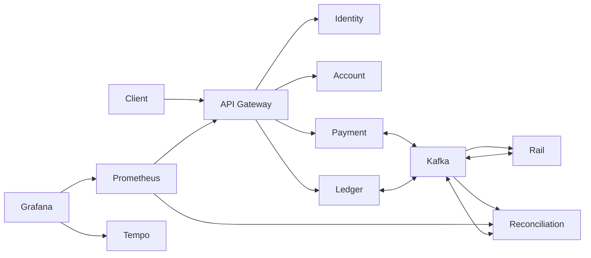
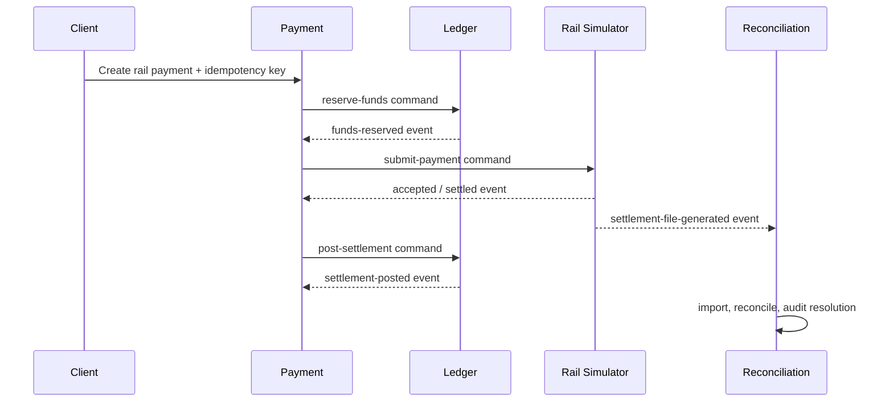

# Stage 7 diagrams

## System architecture

```mermaid
flowchart LR
  Client --> Gateway[API Gateway]
  Gateway --> Identity
  Gateway --> Account
  Gateway --> Payment
  Gateway --> Ledger
  Payment <--> Kafka
  Ledger <--> Kafka
  Rail <--> Kafka
  Reconciliation <--> Kafka
  Kafka --> Rail
  Kafka --> Reconciliation
  Prometheus --> Gateway
  Prometheus --> Reconciliation
  Grafana --> Prometheus
  Grafana --> Tempo
```

## Payment and reconciliation sequence

```mermaid
sequenceDiagram
  participant C as Client
  participant P as Payment
  participant L as Ledger
  participant R as Rail Simulator
  participant X as Reconciliation
  C->>P: Create rail payment + idempotency key
  P->>L: reserve-funds command
  L-->>P: funds-reserved event
  P->>R: submit-payment command
  R-->>P: accepted / settled event
  R-->>X: settlement-file-generated event
  P->>L: post-settlement command
  L-->>P: settlement-posted event
  X->>X: import, reconcile, audit resolution
```
